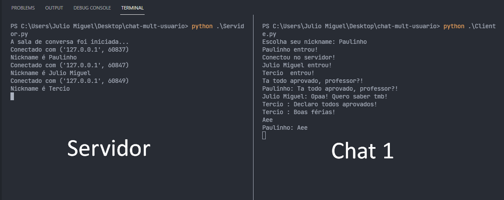
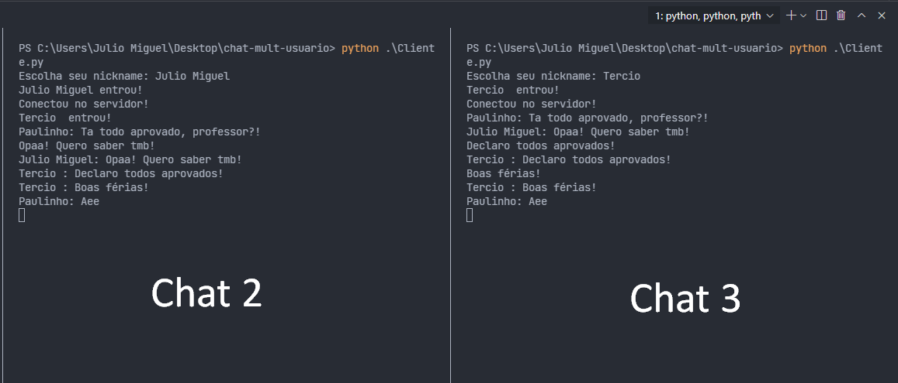

# Chat MultiUsuario

### Simples aplicação de Chat que implementa sincronização das mensagens (dados) usando threads.

### Alunos
* Júlio Miguel de Souza Costa
* Paulo Henrique
 
### Demo

    

 

    

